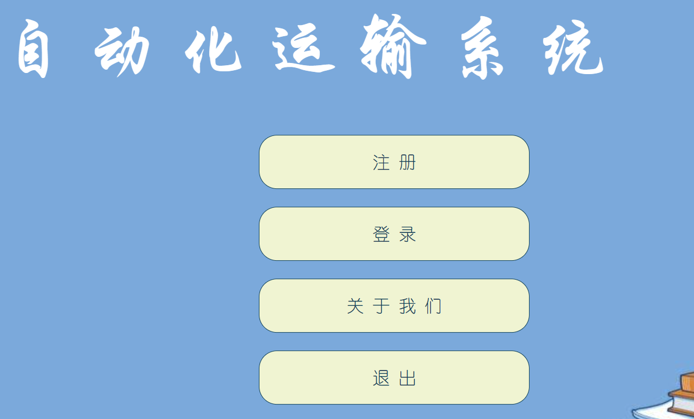
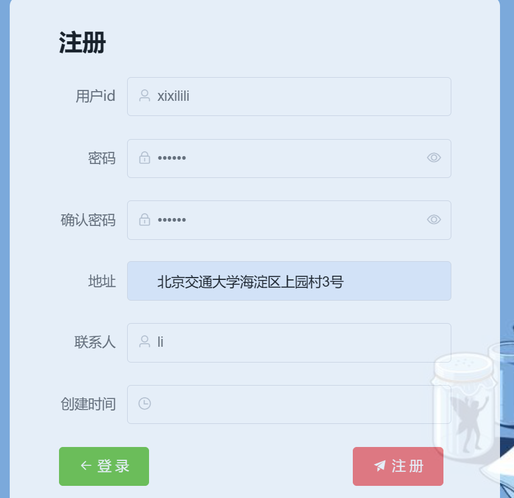
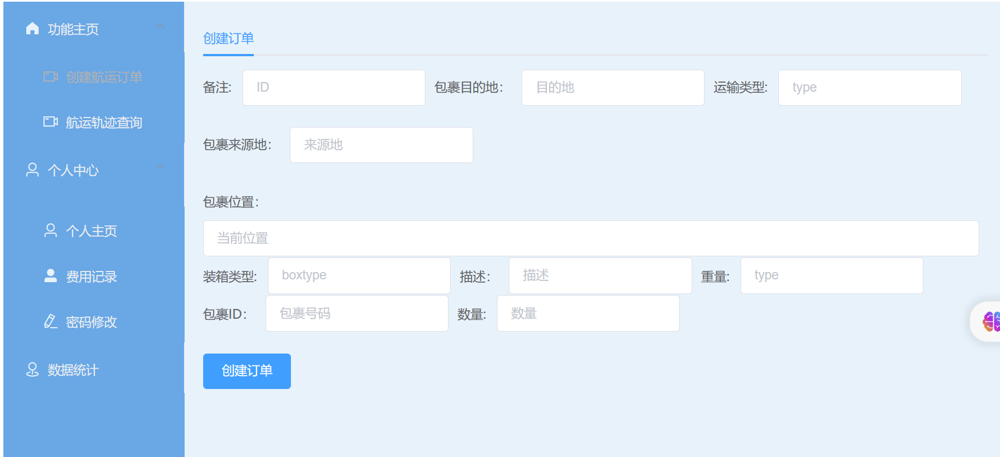
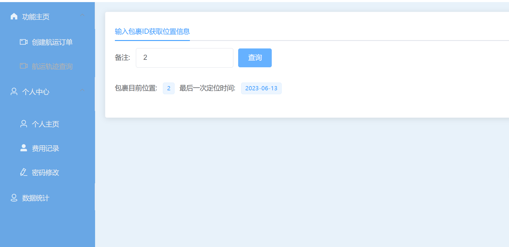

# Vue项目

#### 介绍
实训作业三

#### 软件功能
软件功能说明 
登录注册，包裹订单创建，包裹位置追踪
首页

注册界面

登录界面

主页面/创建航运订单

包裹位置查询

#### 安装教程

1.  xxxx
2.  xxxx
3.  xxxx

#### 使用说明

1.  xxxx
2.  xxxx
3.  xxxx

#### 参与贡献

1.  Fork 本仓库
2.  新建 Feat_xxx 分支
3.  提交代码
4.  新建 Pull Request

#### 特技

